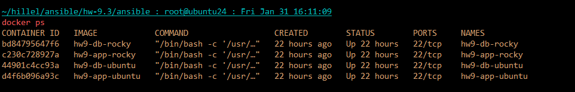
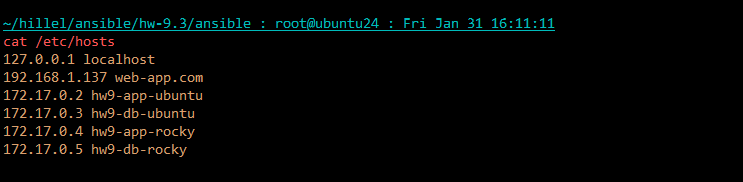
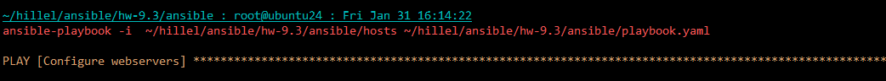
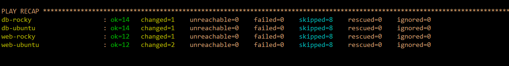
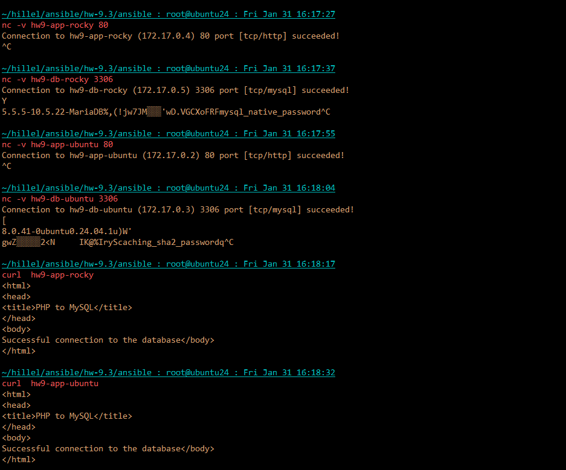

## Containers for Ansible  customization



## Launch of the Ansible 


```bash
ansible-playbook -i  ~/hillel/ansible/hw-9.3/ansible/hosts ~/hillel/ansible/hw-9.3/ansible/playbook.yaml
```
<details>
PLAY [Configure webservers] *****************************************************************************************************************************************************************************************************************

TASK [Gathering Facts] **********************************************************************************************************************************************************************************************************************
[WARNING]: Platform linux on host web-ubuntu is using the discovered Python interpreter at /usr/bin/python3.12, but future installation of another Python interpreter could change the meaning of that path. See
https://docs.ansible.com/ansible-core/2.17/reference_appendices/interpreter_discovery.html for more information.
ok: [web-ubuntu]
[WARNING]: Platform linux on host web-rocky is using the discovered Python interpreter at /usr/bin/python3.9, but future installation of another Python interpreter could change the meaning of that path. See
https://docs.ansible.com/ansible-core/2.17/reference_appendices/interpreter_discovery.html for more information.
ok: [web-rocky]

TASK [common : Update apt packages (for Debian family)] *************************************************************************************************************************************************************************************
skipping: [web-rocky]
ok: [web-ubuntu]

TASK [common : Update dnf packages (for RedHat family)] *************************************************************************************************************************************************************************************
skipping: [web-ubuntu]
ok: [web-rocky]

TASK [apache : Include tasks for installing apache] *****************************************************************************************************************************************************************************************
included: /root/hillel/ansible/hw-9.3/ansible/roles/apache/tasks/install-apache.yaml for web-ubuntu, web-rocky

TASK [apache : Install Apache packages (for Debian family)] *********************************************************************************************************************************************************************************
skipping: [web-rocky]
ok: [web-ubuntu]

TASK [apache : Install Apache packages (for RedHat family)] *********************************************************************************************************************************************************************************
skipping: [web-ubuntu]
ok: [web-rocky]

TASK [apache : Start Apache service using apachectl (for Debian family)] ********************************************************************************************************************************************************************
skipping: [web-rocky]
ok: [web-ubuntu]

TASK [apache : Start Apache service using apachectl (for RedHat family)] ********************************************************************************************************************************************************************
skipping: [web-ubuntu]
ok: [web-rocky]

TASK [apache : Ensure /etc/rc.local exists and is executable (for Debian family)] ***********************************************************************************************************************************************************
skipping: [web-rocky]
changed: [web-ubuntu]

TASK [apache : Add command to start Apache in /etc/rc.local (for Debian family)] ************************************************************************************************************************************************************
skipping: [web-rocky]
ok: [web-ubuntu]

TASK [apache : Restart Apache service using apachectl (for Debian family)] ******************************************************************************************************************************************************************
skipping: [web-rocky]
changed: [web-ubuntu]

TASK [apache : Restart Apache service using apachectl (for RedHat family)] ******************************************************************************************************************************************************************
skipping: [web-ubuntu]
changed: [web-rocky]

TASK [apache : Include tasks for setting up apache] *****************************************************************************************************************************************************************************************
included: /root/hillel/ansible/hw-9.3/ansible/roles/apache/tasks/setup-apache.yaml for web-ubuntu, web-rocky

TASK [apache : Create directory for PHP-FPM socket] *****************************************************************************************************************************************************************************************
skipping: [web-ubuntu]
ok: [web-rocky]

TASK [apache : Check if php-fpm socket exists] **********************************************************************************************************************************************************************************************
skipping: [web-ubuntu]
ok: [web-rocky]

TASK [apache : Start php-fpm manually if socket does not exist] *****************************************************************************************************************************************************************************
skipping: [web-ubuntu]
skipping: [web-rocky]

TASK [apache : Delete index.html file] ******************************************************************************************************************************************************************************************************
ok: [web-ubuntu]
ok: [web-rocky]

TASK [apache : Upload application file] *****************************************************************************************************************************************************************************************************
ok: [web-ubuntu]
ok: [web-rocky]

TASK [apache : Ensure web directory exists (for RedHat family)] *****************************************************************************************************************************************************************************
skipping: [web-ubuntu]
ok: [web-rocky]

TASK [apache : Ensure web directory exists (for Debian family)] *****************************************************************************************************************************************************************************
skipping: [web-rocky]
ok: [web-ubuntu]

PLAY [Configure dbservers] ******************************************************************************************************************************************************************************************************************

TASK [Gathering Facts] **********************************************************************************************************************************************************************************************************************
[WARNING]: Platform linux on host db-ubuntu is using the discovered Python interpreter at /usr/bin/python3.12, but future installation of another Python interpreter could change the meaning of that path. See
https://docs.ansible.com/ansible-core/2.17/reference_appendices/interpreter_discovery.html for more information.
ok: [db-ubuntu]
[WARNING]: Platform linux on host db-rocky is using the discovered Python interpreter at /usr/bin/python3.9, but future installation of another Python interpreter could change the meaning of that path. See
https://docs.ansible.com/ansible-core/2.17/reference_appendices/interpreter_discovery.html for more information.
ok: [db-rocky]

TASK [common : Update apt packages (for Debian family)] *************************************************************************************************************************************************************************************
skipping: [db-rocky]
changed: [db-ubuntu]

TASK [common : Update dnf packages (for RedHat family)] *************************************************************************************************************************************************************************************
skipping: [db-ubuntu]
ok: [db-rocky]

TASK [mysql : Include tasks for installing MySQL] *******************************************************************************************************************************************************************************************
included: /root/hillel/ansible/hw-9.3/ansible/roles/mysql/tasks/install-mysql.yaml for db-ubuntu, db-rocky

TASK [mysql : Install MySQL packages (for Debian family)] ***********************************************************************************************************************************************************************************
skipping: [db-rocky]
ok: [db-ubuntu]

TASK [mysql : Install MySQL packages (for RedHat family)] ***********************************************************************************************************************************************************************************
skipping: [db-ubuntu]
ok: [db-rocky]

TASK [mysql : Initialize MySQL database (for RedHat family)] ********************************************************************************************************************************************************************************
skipping: [db-ubuntu]
changed: [db-rocky]

TASK [mysql : Check if MySQL is running (for Debian family)] ********************************************************************************************************************************************************************************
skipping: [db-rocky]
ok: [db-ubuntu]

TASK [mysql : Check if MySQL is running (for RedHat family)] ********************************************************************************************************************************************************************************
skipping: [db-ubuntu]
ok: [db-rocky]

TASK [mysql : Debug OS family] **************************************************************************************************************************************************************************************************************
ok: [db-ubuntu] => {
    "msg": "OS Family is Debian"
}
ok: [db-rocky] => {
    "msg": "OS Family is RedHat"
}

TASK [mysql : Debug output of mysql_ping_result] ********************************************************************************************************************************************************************************************
ok: [db-ubuntu] => {
    "mysql_ping_result_debian": {
        "changed": false,
        "cmd": [
            "/usr/bin/mysqladmin",
            "--socket=/var/run/mysqld/mysqld.sock",
            "ping"
        ],
        "delta": "0:00:00.011725",
        "end": "2025-01-31 14:14:50.159158",
        "failed": false,
        "failed_when_result": false,
        "msg": "",
        "rc": 0,
        "start": "2025-01-31 14:14:50.147433",
        "stderr": "",
        "stderr_lines": [],
        "stdout": "mysqld is alive",
        "stdout_lines": [
            "mysqld is alive"
        ]
    }
}
skipping: [db-rocky]

TASK [mysql : Start MySQL service using service command (for Debian family)] ****************************************************************************************************************************************************************
skipping: [db-ubuntu]
skipping: [db-rocky]

TASK [mysql : Start MySQL service using mysqld_safe (for RedHat family)] ********************************************************************************************************************************************************************
skipping: [db-ubuntu]
skipping: [db-rocky]

TASK [mysql : Include tasks for setting up MySQL] *******************************************************************************************************************************************************************************************
included: /root/hillel/ansible/hw-9.3/ansible/roles/mysql/tasks/setup-mysql.yaml for db-ubuntu, db-rocky

TASK [mysql : Set the root password] ********************************************************************************************************************************************************************************************************
skipping: [db-rocky]
[WARNING]: Option column_case_sensitive is not provided. The default is now false, so the column's name will be uppercased. The default will be changed to true in community.mysql 4.0.0.
ok: [db-ubuntu]

TASK [mysql : Set the root password (for RedHat family)] ************************************************************************************************************************************************************************************
skipping: [db-ubuntu]
ok: [db-rocky]

TASK [mysql : Update the cnf file] **********************************************************************************************************************************************************************************************************
ok: [db-ubuntu]
ok: [db-rocky]

TASK [mysql : Create a test user] ***********************************************************************************************************************************************************************************************************
ok: [db-ubuntu]
ok: [db-rocky]

TASK [mysql : Remove all anonymous user accounts] *******************************************************************************************************************************************************************************************
ok: [db-ubuntu]
ok: [db-rocky]

TASK [mysql : Remove the MySQL test database] ***********************************************************************************************************************************************************************************************
ok: [db-ubuntu]
ok: [db-rocky]

TASK [mysql : Change bind address (for Debian family)] **************************************************************************************************************************************************************************************
skipping: [db-rocky]
ok: [db-ubuntu]

TASK [mysql : Change bind address (for RedHat family)] **************************************************************************************************************************************************************************************
skipping: [db-ubuntu]
ok: [db-rocky]

PLAY RECAP **********************************************************************************************************************************************************************************************************************************
db-rocky                   : ok=14   changed=1    unreachable=0    failed=0    skipped=8    rescued=0    ignored=0
db-ubuntu                  : ok=14   changed=1    unreachable=0    failed=0    skipped=8    rescued=0    ignored=0
web-rocky                  : ok=12   changed=1    unreachable=0    failed=0    skipped=8    rescued=0    ignored=0
web-ubuntu                 : ok=12   changed=2    unreachable=0    failed=0    skipped=8    rescued=0    ignored=0

</details>

## Examination

