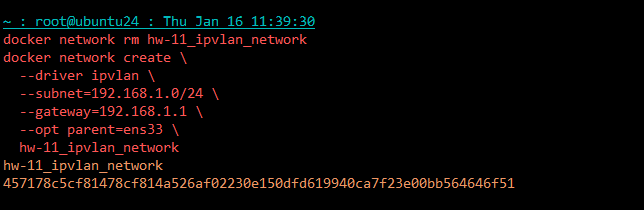
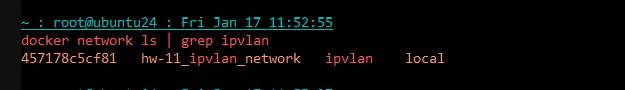
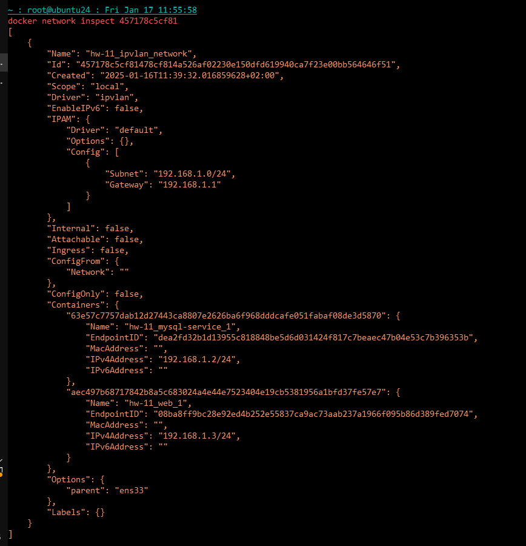
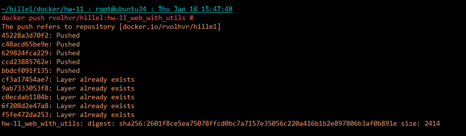
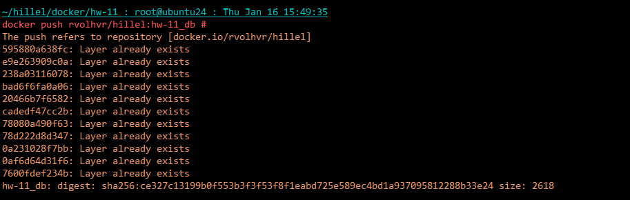
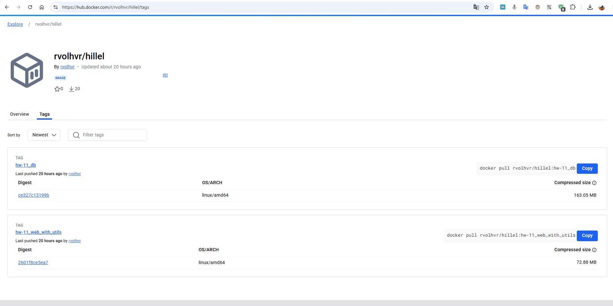
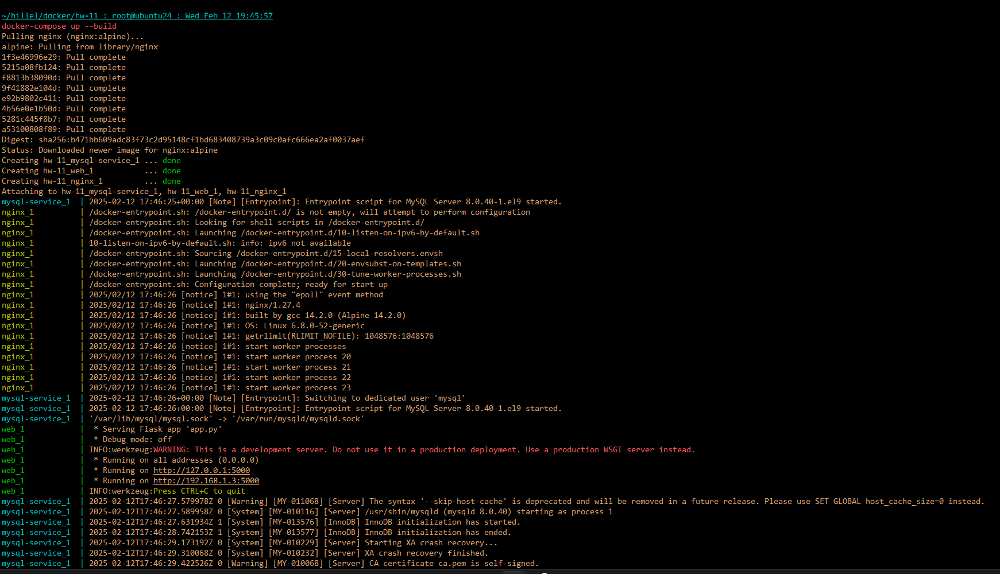
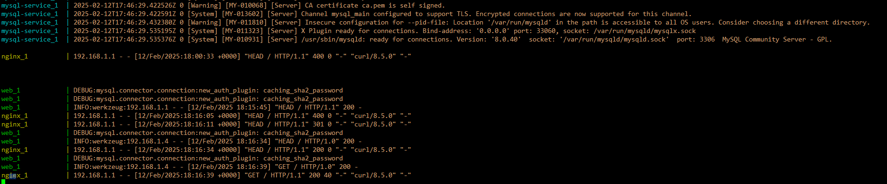
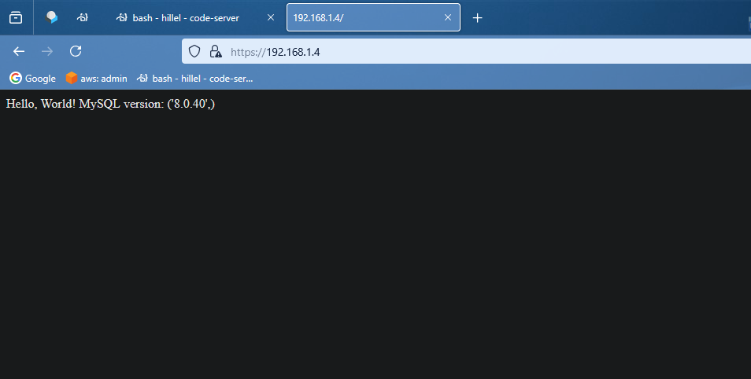

### Creating ipvlan:
```bash
~ : root@ubuntu24 : Thu Jan 16 11:39:30
docker network rm hw-11_ipvlan_network
docker network create \
  --driver ipvlan \
  --subnet=192.168.1.0/24 \
  --gateway=192.168.1.1 \
  --opt parent=ens33 \
  hw-11_ipvlan_network
hw-11_ipvlan_network
457178c5cf81478cf814a526af02230e150dfd619940ca7f23e00bb564646f51
```




## Sending images to docker hub:
```bash
~/hillel/docker/hw-11 : root@ubuntu24 : Thu Jan 16 15:47:15
docker tag rvolhvr/hillel:hw-10_web_with_utils rvolhvr/hillel:hw-11_web_with_utils
docker tag rvolhvr/hillel:hw-10_db rvolhvr/hillel:hw-11_db 
```
```bash
~/hillel/docker/hw-11 : root@ubuntu24 : Thu Jan 16 15:47:48
docker push rvolhvr/hillel:hw-11_web_with_utils #
The push refers to repository [docker.io/rvolhvr/hillel]
45228a3d70f2: Pushed
c48acd65be9e: Pushed
629824fca229: Pushed
ccd23885762e: Pushed
bbdcf091f135: Pushed
cf3a17454ae7: Layer already exists
9ab7333053f8: Layer already exists
c0ecdab1104b: Layer already exists
6f208d2e47a8: Layer already exists
f5fe472da253: Layer already exists
hw-11_web_with_utils: digest: sha256:2601f8ce5ea75078ffcd0bc7a7157e35056c220a416b1b2e897806b3af0b891e size: 2414
```

```bash
docker push rvolhvr/hillel:hw-11_db #
The push refers to repository [docker.io/rvolhvr/hillel]
595880a638fc: Layer already exists
e9e263909c0a: Layer already exists
238a03116078: Layer already exists
bad6f6fa0a06: Layer already exists
20466b7f6582: Layer already exists
cadedf47cc2b: Layer already exists
78080a490f63: Layer already exists
78d222d8d347: Layer already exists
0a231028f7bb: Layer already exists
0af6d64d31f6: Layer already exists
7600fdef234b: Layer already exists
hw-11_db: digest: sha256:ce327c13199b0f553b3f3f53f8f1eabd725e589ec4bd1a937095812288b33e24 size: 2618
```



## Creating containers




## Check http


## Check with HTTPS using Nginx



# The end.