### Create claster:
```bash
minikube delete && minikube start --force &&  minikube dashboard
🔥  Deleting "minikube" in docker ...
🔥  Deleting container "minikube" ...
🔥  Removing /root/.minikube/machines/minikube ...
💀  Removed all traces of the "minikube" cluster.
😄  minikube v1.34.0 on Ubuntu 24.04
❗  minikube skips various validations when --force is supplied; this may lead to unexpected behavior
✨  Automatically selected the docker driver. Other choices: none, ssh
🛑  The "docker" driver should not be used with root privileges. If you wish to continue as root, use --force.
💡  If you are running minikube within a VM, consider using --driver=none:
📘    https://minikube.sigs.k8s.io/docs/reference/drivers/none/
📌  Using Docker driver with root privileges
👍  Starting "minikube" primary control-plane node in "minikube" cluster
🚜  Pulling base image v0.0.45 ...
🔥  Creating docker container (CPUs=2, Memory=2000MB) ...
🐳  Preparing Kubernetes v1.31.0 on Docker 27.2.0 ...
    ▪ Generating certificates and keys ...
    ▪ Booting up control plane ...
    ▪ Configuring RBAC rules ...
🔗  Configuring bridge CNI (Container Networking Interface) ...
🔎  Verifying Kubernetes components...
    ▪ Using image gcr.io/k8s-minikube/storage-provisioner:v5
🌟  Enabled addons: storage-provisioner, default-storageclass
🏄  Done! kubectl is now configured to use "minikube" cluster and "default" namespace by default
🔌  Enabling dashboard ...
    ▪ Using image docker.io/kubernetesui/dashboard:v2.7.0
    ▪ Using image docker.io/kubernetesui/metrics-scraper:v1.0.8
💡  Some dashboard features require the metrics-server addon. To enable all features please run:

        minikube addons enable metrics-server

🤔  Verifying dashboard health ...
🚀  Launching proxy ...
🤔  Verifying proxy health ...
http://127.0.0.1:37225/api/v1/namespaces/kubernetes-dashboard/services/http:kubernetes-dashboard:/proxy/
```
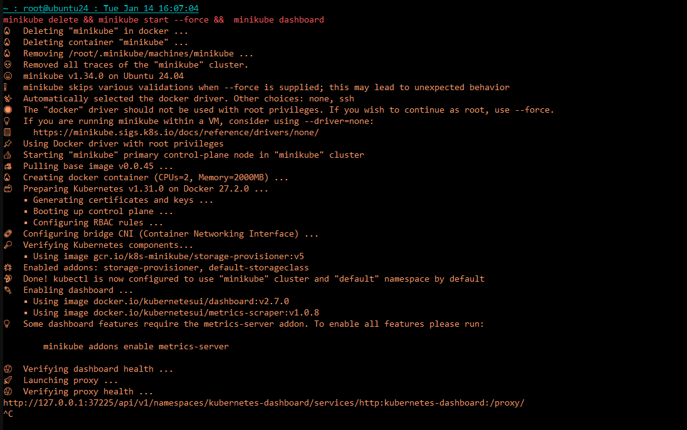

### Proxy for dashbord:
```bash
kubectl proxy --address=0.0.0.0 --accept-hosts='^*$' --port=8080 &
```
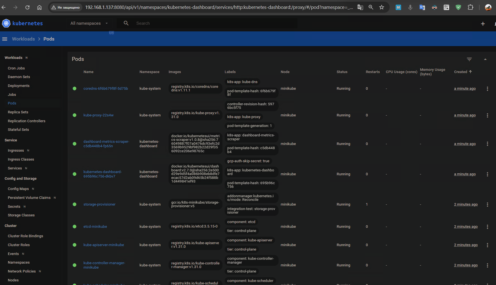

### Show entire cluster:
```bash
kubectl get all --all-namespaces
NAMESPACE              NAME                                            READY   STATUS    RESTARTS        AGE
kube-system            pod/coredns-6f6b679f8f-5d75b                    1/1     Running   0               3m52s
kube-system            pod/etcd-minikube                               1/1     Running   0               3m57s
kube-system            pod/kube-apiserver-minikube                     1/1     Running   0               3m57s
kube-system            pod/kube-controller-manager-minikube            1/1     Running   0               3m57s
kube-system            pod/kube-proxy-22s4w                            1/1     Running   0               3m52s
kube-system            pod/kube-scheduler-minikube                     1/1     Running   0               3m57s
kube-system            pod/storage-provisioner                         1/1     Running   1 (3m22s ago)   3m56s
kubernetes-dashboard   pod/dashboard-metrics-scraper-c5db448b4-fp65n   1/1     Running   0               3m52s
kubernetes-dashboard   pod/kubernetes-dashboard-695b96c756-dkbv7       1/1     Running   0               3m52s

NAMESPACE              NAME                                TYPE        CLUSTER-IP      EXTERNAL-IP   PORT(S)                  AGE
default                service/kubernetes                  ClusterIP   10.96.0.1       <none>        443/TCP                  3m58s
kube-system            service/kube-dns                    ClusterIP   10.96.0.10      <none>        53/UDP,53/TCP,9153/TCP   3m57s
kubernetes-dashboard   service/dashboard-metrics-scraper   ClusterIP   10.106.109.83   <none>        8000/TCP                 3m54s
kubernetes-dashboard   service/kubernetes-dashboard        ClusterIP   10.100.223.9    <none>        80/TCP                   3m54s

NAMESPACE     NAME                        DESIRED   CURRENT   READY   UP-TO-DATE   AVAILABLE   NODE SELECTOR            AGE
kube-system   daemonset.apps/kube-proxy   1         1         1       1            1           kubernetes.io/os=linux   3m57s

NAMESPACE              NAME                                        READY   UP-TO-DATE   AVAILABLE   AGE
kube-system            deployment.apps/coredns                     1/1     1            1           3m57s
kubernetes-dashboard   deployment.apps/dashboard-metrics-scraper   1/1     1            1           3m54s
kubernetes-dashboard   deployment.apps/kubernetes-dashboard        1/1     1            1           3m54s

NAMESPACE              NAME                                                  DESIRED   CURRENT   READY   AGE
kube-system            replicaset.apps/coredns-6f6b679f8f                    1         1         1       3m53s
kubernetes-dashboard   replicaset.apps/dashboard-metrics-scraper-c5db448b4   1         1         1       3m53s
kubernetes-dashboard   replicaset.apps/kubernetes-dashboard-695b96c756       1         1         1       3m53s
```
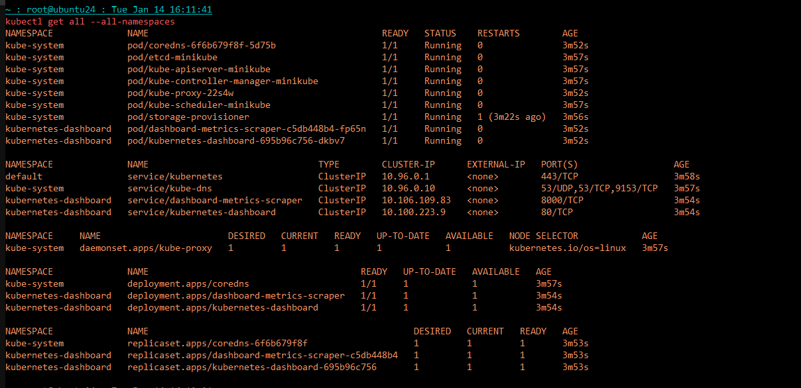
### Load homework 10 images from docker:
```bash
minikube image load hw-10_web:latest mysql:8.0
```

```bash
minikube image list | egrep 'hw-10_web|mysql'
docker.io/library/mysql:8.0
docker.io/library/hw-10_web:latest
```
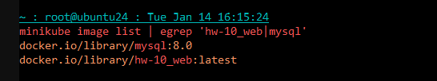

### Creating a secret for DB:
```bash
kubectl create secret generic mysql-secret \
  --from-literal=MYSQL_USER=app_user \
  --from-literal=MYSQL_PASSWORD=apppassword \
  --from-literal=MYSQL_DATABASE=app_db \
  -n hw-13-namespace
secret/mysql-secret created
```
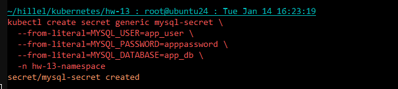

### Apply manifest:
```bash
kubectl apply -f hw-13.yaml
namespace/hw-13-namespace created
deployment.apps/mysql-deployment created
service/mysql-service created
deployment.apps/backend-deployment created
service/backend-service created
deployment.apps/frontend-deployment created
service/frontend-service created
```
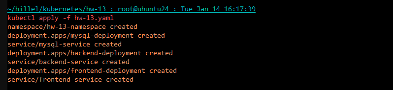

```bash
kubectl get all -n hw-13-namespace
NAME                                       READY   STATUS    RESTARTS   AGE
pod/backend-deployment-77b88d668d-lpxsq    1/1     Running   0          9m59s
pod/frontend-deployment-5b77b8f897-cgcws   1/1     Running   0          2m29s
pod/mysql-deployment-5b48447686-b8mjn      1/1     Running   0          9m59s

NAME                       TYPE        CLUSTER-IP       EXTERNAL-IP   PORT(S)        AGE
service/backend-service    ClusterIP   10.99.156.34     <none>        8080/TCP       9m59s
service/frontend-service   NodePort    10.108.171.1     <none>        80:32722/TCP   9m59s
service/mysql-service      ClusterIP   10.109.125.141   <none>        3306/TCP       9m59s

NAME                                  READY   UP-TO-DATE   AVAILABLE   AGE
deployment.apps/backend-deployment    1/1     1            1           9m59s
deployment.apps/frontend-deployment   1/1     1            1           9m59s
deployment.apps/mysql-deployment      1/1     1            1           9m59s

NAME                                             DESIRED   CURRENT   READY   AGE
replicaset.apps/backend-deployment-77b88d668d    1         1         1       9m59s
replicaset.apps/frontend-deployment-5b77b8f897   1         1         1       9m59s
replicaset.apps/mysql-deployment-5b48447686      1         1         1       9m59s
```
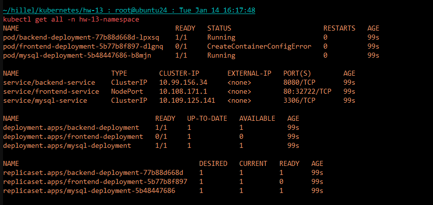

### Forward a port for external access:
```bash
kubectl port-forward -n hw-13-namespace service/frontend-service 8081:80 --address 0.0.0.0 &
```


### Application verification:
```bash
curl http://localhost:8081
Handling connection for 8081
Hello, World! MySQL version: ('8.0.40',)
```
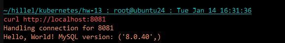
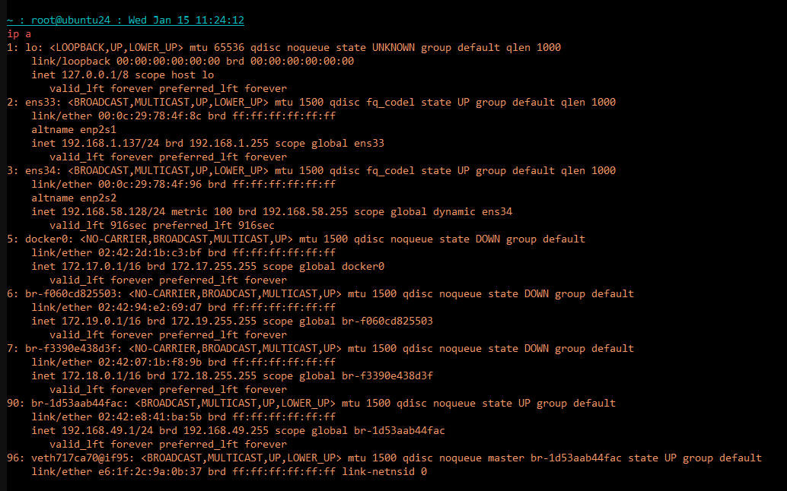
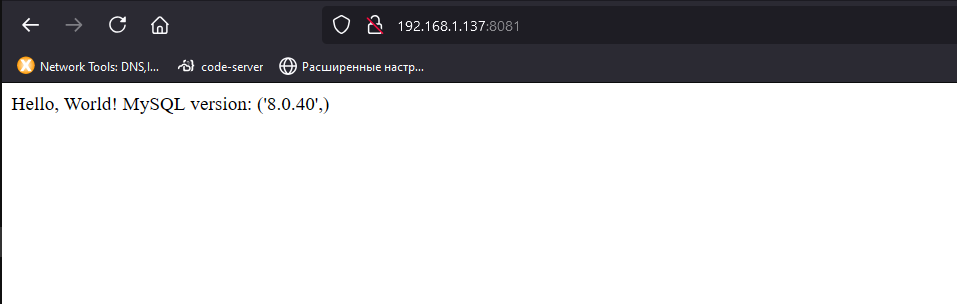

### Checking the database:
```bash
curl -X POST http://192.168.1.137:8081/add_user      -H "Content-Type: application/json"      -d '{"name": "Jane Doe", "email": "jane.doe@example.com"}'
Handling connection for 8081
{"message":"User added successfully!"}

curl -X POST http://192.168.1.137:8081/add_user      -H "Content-Type: application/json"      -d '{"name": "Tony Stark", "email": "tony.stark@example.com"}'
Handling connection for 8081
{"message":"User added successfully!"}
```
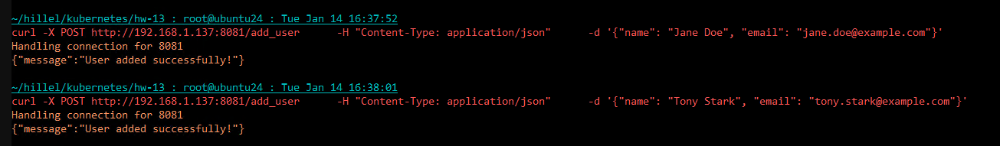

```bash
kubectl exec -it pod/mysql-deployment-5b48447686-b8mjn -n hw-13-namespace -- /bin/bash
bash-5.1# mysql -u app_user -p app_db
Enter password:
Reading table information for completion of table and column names
You can turn off this feature to get a quicker startup with -A

Welcome to the MySQL monitor.  Commands end with ; or \g.
Your MySQL connection id is 14
Server version: 8.0.40 MySQL Community Server - GPL

Copyright (c) 2000, 2024, Oracle and/or its affiliates.

Oracle is a registered trademark of Oracle Corporation and/or its
affiliates. Other names may be trademarks of their respective
owners.

Type 'help;' or '\h' for help. Type '\c' to clear the current input statement.

mysql> SELECT * FROM users;
+----+------------+------------------------+
| id | name       | email                  |
+----+------------+------------------------+
|  1 | Jane Doe   | jane.doe@example.com   |
|  2 | Tony Stark | tony.stark@example.com |
+----+------------+------------------------+
2 rows in set (0.00 sec)
```
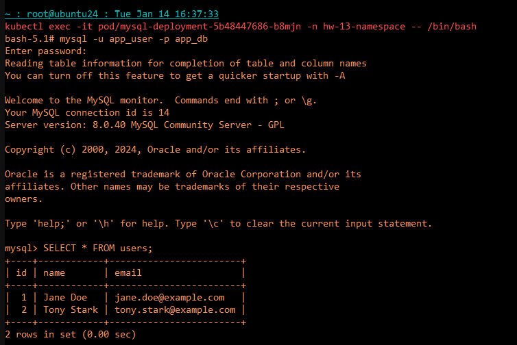

# The end.
