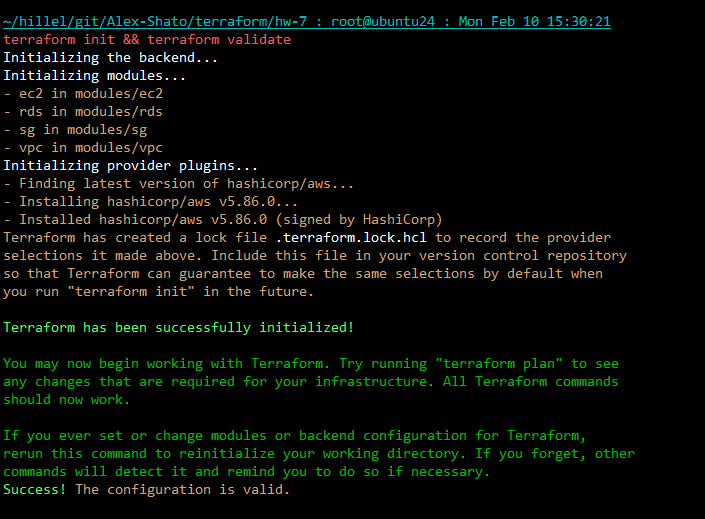
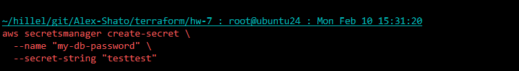
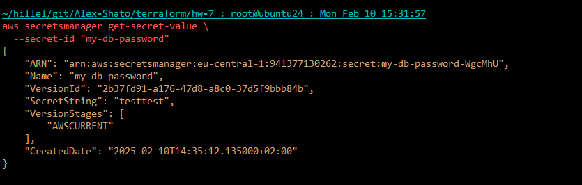
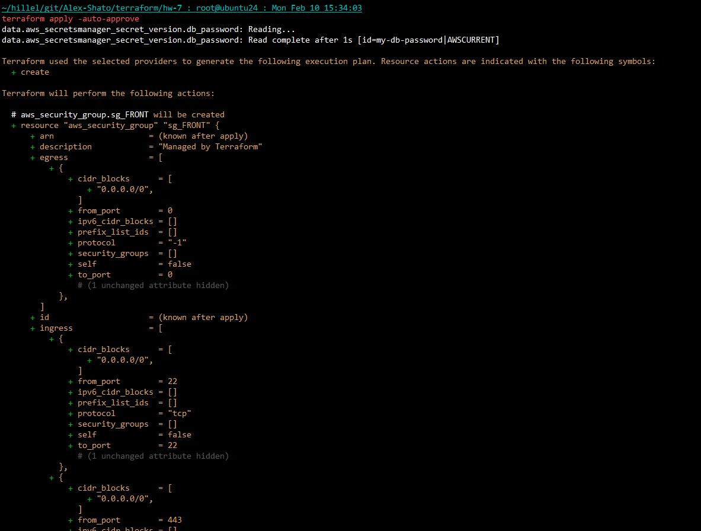
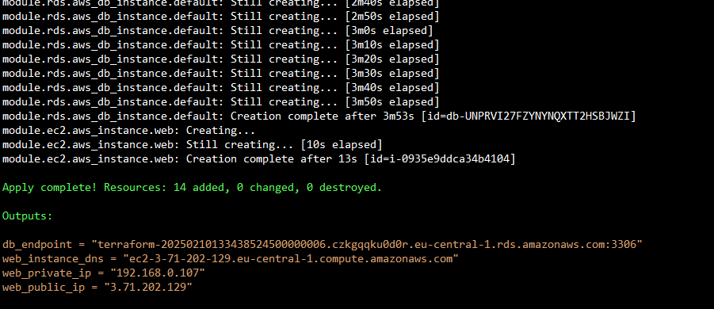
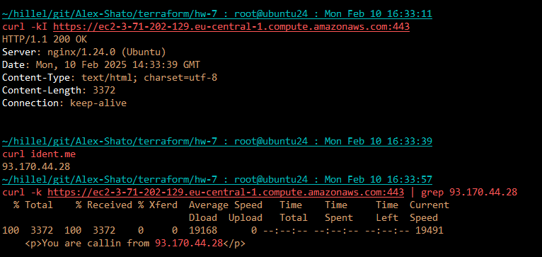
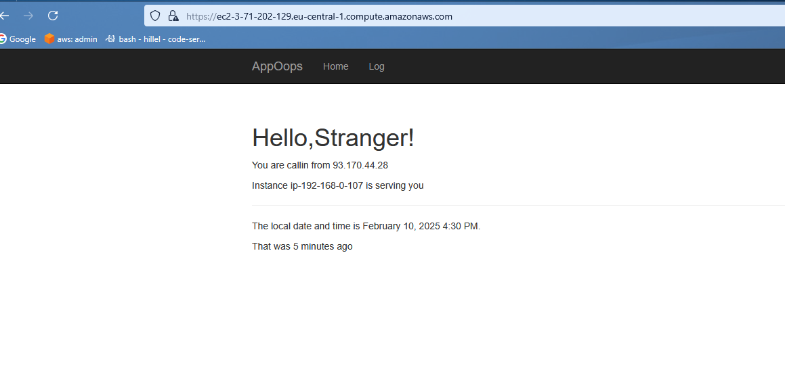
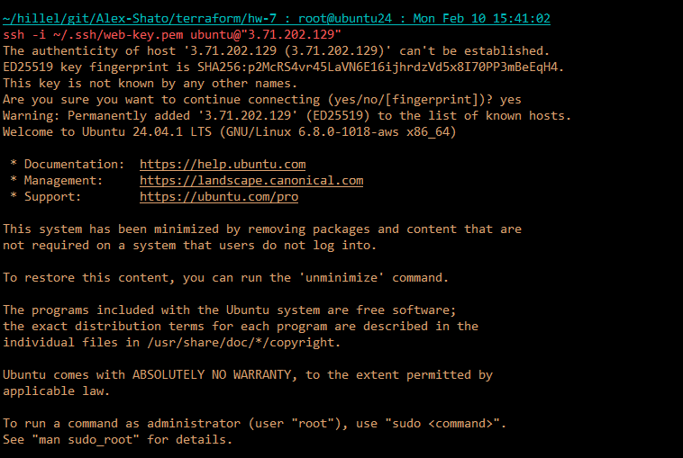
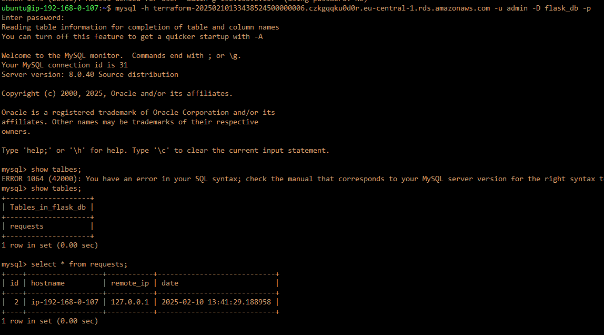

## Init and validate terrafom configs:


## Creating and checkin a secret in AWS Secrets Manager to store the database password:



## Applying the configuration:

```bash
...
```


<details>

```bash
terraform apply -auto-approve

data.aws_secretsmanager_secret_version.db_password: Reading...
data.aws_secretsmanager_secret_version.db_password: Read complete after 1s [id=my-db-password|AWSCURRENT]

Terraform used the selected providers to generate the following execution plan. Resource actions are indicated with the following symbols:
  + create

Terraform will perform the following actions:

  # aws_security_group.sg_FRONT will be created
  + resource "aws_security_group" "sg_FRONT" {
      + arn                    = (known after apply)
      + description            = "Managed by Terraform"
      + egress                 = [
          + {
              + cidr_blocks      = [
                  + "0.0.0.0/0",
                ]
              + from_port        = 0
              + ipv6_cidr_blocks = []
              + prefix_list_ids  = []
              + protocol         = "-1"
              + security_groups  = []
              + self             = false
              + to_port          = 0
                # (1 unchanged attribute hidden)
            },
        ]
      + id                     = (known after apply)
      + ingress                = [
          + {
              + cidr_blocks      = [
                  + "0.0.0.0/0",
                ]
              + from_port        = 22
              + ipv6_cidr_blocks = []
              + prefix_list_ids  = []
              + protocol         = "tcp"
              + security_groups  = []
              + self             = false
              + to_port          = 22
                # (1 unchanged attribute hidden)
            },
          + {
              + cidr_blocks      = [
                  + "0.0.0.0/0",
                ]
              + from_port        = 443
              + ipv6_cidr_blocks = []
              + prefix_list_ids  = []
              + protocol         = "tcp"
              + security_groups  = []
              + self             = false
              + to_port          = 443
                # (1 unchanged attribute hidden)
            },
          + {
              + cidr_blocks      = [
                  + "0.0.0.0/0",
                ]
              + from_port        = 8000
              + ipv6_cidr_blocks = []
              + prefix_list_ids  = []
              + protocol         = "tcp"
              + security_groups  = []
              + self             = false
              + to_port          = 8000
                # (1 unchanged attribute hidden)
            },
          + {
              + cidr_blocks      = [
                  + "0.0.0.0/0",
                ]
              + from_port        = 80
              + ipv6_cidr_blocks = []
              + prefix_list_ids  = []
              + protocol         = "tcp"
              + security_groups  = []
              + self             = false
              + to_port          = 80
                # (1 unchanged attribute hidden)
            },
        ]
      + name                   = (known after apply)
      + name_prefix            = (known after apply)
      + owner_id               = (known after apply)
      + revoke_rules_on_delete = false
      + tags                   = {
          + "Name" = "sg-FRONT"
        }
      + tags_all               = {
          + "Name" = "sg-FRONT"
        }
      + vpc_id                 = (known after apply)
    }

  # aws_security_group.sg_RDS will be created
  + resource "aws_security_group" "sg_RDS" {
      + arn                    = (known after apply)
      + description            = "Managed by Terraform"
      + egress                 = [
          + {
              + cidr_blocks      = [
                  + "0.0.0.0/0",
                ]
              + from_port        = 0
              + ipv6_cidr_blocks = []
              + prefix_list_ids  = []
              + protocol         = "-1"
              + security_groups  = []
              + self             = false
              + to_port          = 0
                # (1 unchanged attribute hidden)
            },
        ]
      + id                     = (known after apply)
      + ingress                = [
          + {
              + cidr_blocks      = []
              + from_port        = 3306
              + ipv6_cidr_blocks = []
              + prefix_list_ids  = []
              + protocol         = "tcp"
              + security_groups  = (known after apply)
              + self             = false
              + to_port          = 3306
                # (1 unchanged attribute hidden)
            },
        ]
      + name                   = (known after apply)
      + name_prefix            = (known after apply)
      + owner_id               = (known after apply)
      + revoke_rules_on_delete = false
      + tags                   = {
          + "Name" = "sg-RDS"
        }
      + tags_all               = {
          + "Name" = "sg-RDS"
        }
      + vpc_id                 = (known after apply)
    }

  # module.ec2.aws_instance.web will be created
  + resource "aws_instance" "web" {
      + ami                                  = "ami-0117e0866dc5caa32"
      + arn                                  = (known after apply)
      + associate_public_ip_address          = (known after apply)
      + availability_zone                    = (known after apply)
      + cpu_core_count                       = (known after apply)
      + cpu_threads_per_core                 = (known after apply)
      + disable_api_stop                     = (known after apply)
      + disable_api_termination              = (known after apply)
      + ebs_optimized                        = (known after apply)
      + enable_primary_ipv6                  = (known after apply)
      + get_password_data                    = false
      + host_id                              = (known after apply)
      + host_resource_group_arn              = (known after apply)
      + iam_instance_profile                 = (known after apply)
      + id                                   = (known after apply)
      + instance_initiated_shutdown_behavior = (known after apply)
      + instance_lifecycle                   = (known after apply)
      + instance_state                       = (known after apply)
      + instance_type                        = "t2.micro"
      + ipv6_address_count                   = (known after apply)
      + ipv6_addresses                       = (known after apply)
      + key_name                             = "web-key"
      + monitoring                           = (known after apply)
      + outpost_arn                          = (known after apply)
      + password_data                        = (known after apply)
      + placement_group                      = (known after apply)
      + placement_partition_number           = (known after apply)
      + primary_network_interface_id         = (known after apply)
      + private_dns                          = (known after apply)
      + private_ip                           = (known after apply)
      + public_dns                           = (known after apply)
      + public_ip                            = (known after apply)
      + secondary_private_ips                = (known after apply)
      + security_groups                      = (known after apply)
      + source_dest_check                    = true
      + spot_instance_request_id             = (known after apply)
      + subnet_id                            = (known after apply)
      + tags                                 = {
          + "Name" = "web-instance"
        }
      + tags_all                             = {
          + "Name" = "web-instance"
        }
      + tenancy                              = (known after apply)
      + user_data                            = (sensitive value)
      + user_data_base64                     = (known after apply)
      + user_data_replace_on_change          = false
      + vpc_security_group_ids               = (known after apply)

      + capacity_reservation_specification (known after apply)

      + cpu_options (known after apply)

      + ebs_block_device (known after apply)

      + enclave_options (known after apply)

      + ephemeral_block_device (known after apply)

      + instance_market_options (known after apply)

      + maintenance_options (known after apply)

      + metadata_options (known after apply)

      + network_interface (known after apply)

      + private_dns_name_options (known after apply)

      + root_block_device (known after apply)
    }

  # module.rds.aws_db_instance.default will be created
  + resource "aws_db_instance" "default" {
      + address                               = (known after apply)
      + allocated_storage                     = 20
      + apply_immediately                     = false
      + arn                                   = (known after apply)
      + auto_minor_version_upgrade            = true
      + availability_zone                     = (known after apply)
      + backup_retention_period               = (known after apply)
      + backup_target                         = (known after apply)
      + backup_window                         = (known after apply)
      + ca_cert_identifier                    = (known after apply)
      + character_set_name                    = (known after apply)
      + copy_tags_to_snapshot                 = false
      + db_name                               = (sensitive value)
      + db_subnet_group_name                  = "main-db-subnet-group"
      + dedicated_log_volume                  = false
      + delete_automated_backups              = true
      + domain_fqdn                           = (known after apply)
      + endpoint                              = (known after apply)
      + engine                                = "mysql"
      + engine_lifecycle_support              = (known after apply)
      + engine_version                        = "8.0"
      + engine_version_actual                 = (known after apply)
      + hosted_zone_id                        = (known after apply)
      + id                                    = (known after apply)
      + identifier                            = (known after apply)
      + identifier_prefix                     = (known after apply)
      + instance_class                        = "db.t3.micro"
      + iops                                  = (known after apply)
      + kms_key_id                            = (known after apply)
      + latest_restorable_time                = (known after apply)
      + license_model                         = (known after apply)
      + listener_endpoint                     = (known after apply)
      + maintenance_window                    = (known after apply)
      + master_user_secret                    = (known after apply)
      + master_user_secret_kms_key_id         = (known after apply)
      + monitoring_interval                   = 0
      + monitoring_role_arn                   = (known after apply)
      + multi_az                              = (known after apply)
      + nchar_character_set_name              = (known after apply)
      + network_type                          = (known after apply)
      + option_group_name                     = (known after apply)
      + parameter_group_name                  = (known after apply)
      + password                              = (sensitive value)
      + performance_insights_enabled          = false
      + performance_insights_kms_key_id       = (known after apply)
      + performance_insights_retention_period = (known after apply)
      + port                                  = (known after apply)
      + publicly_accessible                   = false
      + replica_mode                          = (known after apply)
      + replicas                              = (known after apply)
      + resource_id                           = (known after apply)
      + skip_final_snapshot                   = true
      + snapshot_identifier                   = (known after apply)
      + status                                = (known after apply)
      + storage_throughput                    = (known after apply)
      + storage_type                          = "gp2"
      + tags                                  = {
          + "Name" = "rds-instance"
        }
      + tags_all                              = {
          + "Name" = "rds-instance"
        }
      + timezone                              = (known after apply)
      + username                              = (sensitive value)
      + vpc_security_group_ids                = (known after apply)
    }

  # module.rds.aws_db_subnet_group.default will be created
  + resource "aws_db_subnet_group" "default" {
      + arn                     = (known after apply)
      + description             = "Managed by Terraform"
      + id                      = (known after apply)
      + name                    = "main-db-subnet-group"
      + name_prefix             = (known after apply)
      + subnet_ids              = (known after apply)
      + supported_network_types = (known after apply)
      + tags                    = {
          + "Name" = "db-subnet-group"
        }
      + tags_all                = {
          + "Name" = "db-subnet-group"
        }
      + vpc_id                  = (known after apply)
    }

  # module.sg.aws_security_group.sg_FRONT will be created
  + resource "aws_security_group" "sg_FRONT" {
      + arn                    = (known after apply)
      + description            = "Managed by Terraform"
      + egress                 = [
          + {
              + cidr_blocks      = [
                  + "0.0.0.0/0",
                ]
              + from_port        = 0
              + ipv6_cidr_blocks = []
              + prefix_list_ids  = []
              + protocol         = "-1"
              + security_groups  = []
              + self             = false
              + to_port          = 0
                # (1 unchanged attribute hidden)
            },
        ]
      + id                     = (known after apply)
      + ingress                = [
          + {
              + cidr_blocks      = [
                  + "0.0.0.0/0",
                ]
              + from_port        = 22
              + ipv6_cidr_blocks = []
              + prefix_list_ids  = []
              + protocol         = "tcp"
              + security_groups  = []
              + self             = false
              + to_port          = 22
                # (1 unchanged attribute hidden)
            },
          + {
              + cidr_blocks      = [
                  + "0.0.0.0/0",
                ]
              + from_port        = 443
              + ipv6_cidr_blocks = []
              + prefix_list_ids  = []
              + protocol         = "tcp"
              + security_groups  = []
              + self             = false
              + to_port          = 443
                # (1 unchanged attribute hidden)
            },
          + {
              + cidr_blocks      = [
                  + "0.0.0.0/0",
                ]
              + from_port        = 8000
              + ipv6_cidr_blocks = []
              + prefix_list_ids  = []
              + protocol         = "tcp"
              + security_groups  = []
              + self             = false
              + to_port          = 8000
                # (1 unchanged attribute hidden)
            },
          + {
              + cidr_blocks      = [
                  + "0.0.0.0/0",
                ]
              + from_port        = 80
              + ipv6_cidr_blocks = []
              + prefix_list_ids  = []
              + protocol         = "tcp"
              + security_groups  = []
              + self             = false
              + to_port          = 80
                # (1 unchanged attribute hidden)
            },
        ]
      + name                   = (known after apply)
      + name_prefix            = (known after apply)
      + owner_id               = (known after apply)
      + revoke_rules_on_delete = false
      + tags                   = {
          + "Name" = "sg-FRONT"
        }
      + tags_all               = {
          + "Name" = "sg-FRONT"
        }
      + vpc_id                 = (known after apply)
    }

  # module.sg.aws_security_group.sg_RDS will be created
  + resource "aws_security_group" "sg_RDS" {
      + arn                    = (known after apply)
      + description            = "Managed by Terraform"
      + egress                 = [
          + {
              + cidr_blocks      = [
                  + "0.0.0.0/0",
                ]
              + from_port        = 0
              + ipv6_cidr_blocks = []
              + prefix_list_ids  = []
              + protocol         = "-1"
              + security_groups  = []
              + self             = false
              + to_port          = 0
                # (1 unchanged attribute hidden)
            },
        ]
      + id                     = (known after apply)
      + ingress                = [
          + {
              + cidr_blocks      = []
              + from_port        = 3306
              + ipv6_cidr_blocks = []
              + prefix_list_ids  = []
              + protocol         = "tcp"
              + security_groups  = (known after apply)
              + self             = false
              + to_port          = 3306
                # (1 unchanged attribute hidden)
            },
        ]
      + name                   = (known after apply)
      + name_prefix            = (known after apply)
      + owner_id               = (known after apply)
      + revoke_rules_on_delete = false
      + tags                   = {
          + "Name" = "sg-RDS"
        }
      + tags_all               = {
          + "Name" = "sg-RDS"
        }
      + vpc_id                 = (known after apply)
    }

  # module.vpc.aws_internet_gateway.igw will be created
  + resource "aws_internet_gateway" "igw" {
      + arn      = (known after apply)
      + id       = (known after apply)
      + owner_id = (known after apply)
      + tags     = {
          + "Name" = "main-igw"
        }
      + tags_all = {
          + "Name" = "main-igw"
        }
      + vpc_id   = (known after apply)
    }

  # module.vpc.aws_route_table.public will be created
  + resource "aws_route_table" "public" {
      + arn              = (known after apply)
      + id               = (known after apply)
      + owner_id         = (known after apply)
      + propagating_vgws = (known after apply)
      + route            = [
          + {
              + cidr_block                 = "0.0.0.0/0"
              + gateway_id                 = (known after apply)
                # (11 unchanged attributes hidden)
            },
        ]
      + tags             = {
          + "Name" = "public-route-table"
        }
      + tags_all         = {
          + "Name" = "public-route-table"
        }
      + vpc_id           = (known after apply)
    }

  # module.vpc.aws_route_table_association.public will be created
  + resource "aws_route_table_association" "public" {
      + id             = (known after apply)
      + route_table_id = (known after apply)
      + subnet_id      = (known after apply)
    }

  # module.vpc.aws_subnet.private_1 will be created
  + resource "aws_subnet" "private_1" {
      + arn                                            = (known after apply)
      + assign_ipv6_address_on_creation                = false
      + availability_zone                              = "eu-central-1a"
      + availability_zone_id                           = (known after apply)
      + cidr_block                                     = "192.168.0.128/26"
      + enable_dns64                                   = false
      + enable_resource_name_dns_a_record_on_launch    = false
      + enable_resource_name_dns_aaaa_record_on_launch = false
      + id                                             = (known after apply)
      + ipv6_cidr_block_association_id                 = (known after apply)
      + ipv6_native                                    = false
      + map_public_ip_on_launch                        = false
      + owner_id                                       = (known after apply)
      + private_dns_hostname_type_on_launch            = (known after apply)
      + tags                                           = {
          + "Name" = "private-subnet-1"
        }
      + tags_all                                       = {
          + "Name" = "private-subnet-1"
        }
      + vpc_id                                         = (known after apply)
    }

  # module.vpc.aws_subnet.private_2 will be created
  + resource "aws_subnet" "private_2" {
      + arn                                            = (known after apply)
      + assign_ipv6_address_on_creation                = false
      + availability_zone                              = "eu-central-1b"
      + availability_zone_id                           = (known after apply)
      + cidr_block                                     = "192.168.0.192/26"
      + enable_dns64                                   = false
      + enable_resource_name_dns_a_record_on_launch    = false
      + enable_resource_name_dns_aaaa_record_on_launch = false
      + id                                             = (known after apply)
      + ipv6_cidr_block_association_id                 = (known after apply)
      + ipv6_native                                    = false
      + map_public_ip_on_launch                        = false
      + owner_id                                       = (known after apply)
      + private_dns_hostname_type_on_launch            = (known after apply)
      + tags                                           = {
          + "Name" = "private-subnet-2"
        }
      + tags_all                                       = {
          + "Name" = "private-subnet-2"
        }
      + vpc_id                                         = (known after apply)
    }

  # module.vpc.aws_subnet.public will be created
  + resource "aws_subnet" "public" {
      + arn                                            = (known after apply)
      + assign_ipv6_address_on_creation                = false
      + availability_zone                              = (known after apply)
      + availability_zone_id                           = (known after apply)
      + cidr_block                                     = "192.168.0.0/25"
      + enable_dns64                                   = false
      + enable_resource_name_dns_a_record_on_launch    = false
      + enable_resource_name_dns_aaaa_record_on_launch = false
      + id                                             = (known after apply)
      + ipv6_cidr_block_association_id                 = (known after apply)
      + ipv6_native                                    = false
      + map_public_ip_on_launch                        = true
      + owner_id                                       = (known after apply)
      + private_dns_hostname_type_on_launch            = (known after apply)
      + tags                                           = {
          + "Name" = "public-subnet"
        }
      + tags_all                                       = {
          + "Name" = "public-subnet"
        }
      + vpc_id                                         = (known after apply)
    }

  # module.vpc.aws_vpc.main will be created
  + resource "aws_vpc" "main" {
      + arn                                  = (known after apply)
      + cidr_block                           = "192.168.0.0/24"
      + default_network_acl_id               = (known after apply)
      + default_route_table_id               = (known after apply)
      + default_security_group_id            = (known after apply)
      + dhcp_options_id                      = (known after apply)
      + enable_dns_hostnames                 = true
      + enable_dns_support                   = true
      + enable_network_address_usage_metrics = (known after apply)
      + id                                   = (known after apply)
      + instance_tenancy                     = "default"
      + ipv6_association_id                  = (known after apply)
      + ipv6_cidr_block                      = (known after apply)
      + ipv6_cidr_block_network_border_group = (known after apply)
      + main_route_table_id                  = (known after apply)
      + owner_id                             = (known after apply)
      + tags                                 = {
          + "Name" = "main-vpc"
        }
      + tags_all                             = {
          + "Name" = "main-vpc"
        }
    }

Plan: 14 to add, 0 to change, 0 to destroy.

Changes to Outputs:
  + db_endpoint      = (known after apply)
  + web_instance_dns = (known after apply)
  + web_private_ip   = (known after apply)
  + web_public_ip    = (known after apply)
module.vpc.aws_vpc.main: Creating...
module.vpc.aws_vpc.main: Still creating... [10s elapsed]
module.vpc.aws_vpc.main: Creation complete after 12s [id=vpc-0f3d5cb145c29da4e]
module.vpc.aws_subnet.private_1: Creating...
module.vpc.aws_subnet.private_2: Creating...
module.vpc.aws_internet_gateway.igw: Creating...
module.vpc.aws_subnet.public: Creating...
module.sg.aws_security_group.sg_FRONT: Creating...
aws_security_group.sg_FRONT: Creating...
module.vpc.aws_internet_gateway.igw: Creation complete after 1s [id=igw-0591b3cf39545c15e]
module.vpc.aws_route_table.public: Creating...
module.vpc.aws_subnet.private_1: Creation complete after 1s [id=subnet-0ea24bbdb03fea36c]
module.vpc.aws_route_table.public: Creation complete after 1s [id=rtb-0c6719585e984f466]
aws_security_group.sg_FRONT: Creation complete after 3s [id=sg-02ec944f57ca1d013]
aws_security_group.sg_RDS: Creating...
module.sg.aws_security_group.sg_FRONT: Creation complete after 3s [id=sg-0b3e524ace52b7021]
module.sg.aws_security_group.sg_RDS: Creating...
module.vpc.aws_subnet.private_2: Creation complete after 3s [id=subnet-0bfa3ce0e07db7c11]
module.rds.aws_db_subnet_group.default: Creating...
module.rds.aws_db_subnet_group.default: Creation complete after 1s [id=main-db-subnet-group]
aws_security_group.sg_RDS: Creation complete after 2s [id=sg-00c1a67c7bea2d71e]
module.sg.aws_security_group.sg_RDS: Creation complete after 3s [id=sg-07d3e07ed37584d33]
module.rds.aws_db_instance.default: Creating...
module.vpc.aws_subnet.public: Still creating... [10s elapsed]
module.vpc.aws_subnet.public: Creation complete after 13s [id=subnet-0452c7fa1404e6fad]
module.vpc.aws_route_table_association.public: Creating...
module.vpc.aws_route_table_association.public: Creation complete after 0s [id=rtbassoc-03fede921a79aa2a2]
module.rds.aws_db_instance.default: Still creating... [10s elapsed]
module.rds.aws_db_instance.default: Still creating... [20s elapsed]
module.rds.aws_db_instance.default: Still creating... [30s elapsed]
module.rds.aws_db_instance.default: Still creating... [40s elapsed]
module.rds.aws_db_instance.default: Still creating... [50s elapsed]
module.rds.aws_db_instance.default: Still creating... [1m0s elapsed]
module.rds.aws_db_instance.default: Still creating... [1m10s elapsed]
module.rds.aws_db_instance.default: Still creating... [1m20s elapsed]
module.rds.aws_db_instance.default: Still creating... [1m30s elapsed]
module.rds.aws_db_instance.default: Still creating... [1m40s elapsed]
module.rds.aws_db_instance.default: Still creating... [1m50s elapsed]
module.rds.aws_db_instance.default: Still creating... [2m0s elapsed]
module.rds.aws_db_instance.default: Still creating... [2m10s elapsed]
module.rds.aws_db_instance.default: Still creating... [2m20s elapsed]
module.rds.aws_db_instance.default: Still creating... [2m30s elapsed]
module.rds.aws_db_instance.default: Still creating... [2m40s elapsed]
module.rds.aws_db_instance.default: Still creating... [2m50s elapsed]
module.rds.aws_db_instance.default: Still creating... [3m0s elapsed]
module.rds.aws_db_instance.default: Still creating... [3m10s elapsed]
module.rds.aws_db_instance.default: Still creating... [3m20s elapsed]
module.rds.aws_db_instance.default: Still creating... [3m30s elapsed]
module.rds.aws_db_instance.default: Still creating... [3m40s elapsed]
module.rds.aws_db_instance.default: Still creating... [3m50s elapsed]
module.rds.aws_db_instance.default: Creation complete after 3m53s [id=db-UNPRVI27FZYNYNQXTT2HSBJWZI]
module.ec2.aws_instance.web: Creating...
module.ec2.aws_instance.web: Still creating... [10s elapsed]
module.ec2.aws_instance.web: Creation complete after 13s [id=i-0935e9ddca34b4104]

Apply complete! Resources: 14 added, 0 changed, 0 destroyed.

Outputs:

db_endpoint = "terraform-20250210133438524500000006.czkgqqku0d0r.eu-central-1.rds.amazonaws.com:3306"
web_instance_dns = "ec2-3-71-202-129.eu-central-1.compute.amazonaws.com"
web_private_ip = "192.168.0.107"
web_public_ip = "3.71.202.129"
```
</details>

## Checks:

<details>

```bash
curl -k https://ec2-3-71-202-129.eu-central-1.compute.amazonaws.com:443
<!DOCTYPE html>
<html>
  <head>

    <title>AppOops</title>
    <meta name="viewport" content="width=device-width, initial-scale=1.0">
    <!-- Bootstrap -->
    <link href="//cdnjs.cloudflare.com/ajax/libs/twitter-bootstrap/3.3.7/css/bootstrap.min.css" rel="stylesheet">
<link rel="shortcut icon" href="/static/favicon.ico" type="image/x-icon">
<link rel="icon" href="/static/favicon.ico" type="image/x-icon">

  </head>
  <body>

<div class="navbar navbar-inverse" role="navigation">
 <div class="container">
  <div class="navbar-header">
    <button type="button" class="navbar-toggle"
    data-toggle="collapse" data-target=".navbar-collapse">
      <span class="sr-only">Toggle navigation</span>
      <span class="icon-bar"></span>
      <span class="icon-bar"></span>
      <span class="icon-bar"></span>
    </button>
    <a class="navbar-brand" href="/">AppOops</a>
  </div>
  <div class="navbar-collapse collapse">
    <ul class="nav navbar-nav">
      <li><a href="/">Home</a></li>
          <li><a href="/display">Log</a></li>
    </ul>
  </div>
 </div>
</div>


<div class="container">


 <div class="page-header">
    <h1>Hello,Stranger!</h1>
    <p>You are callin from 93.170.44.28</p>
    <p>Instance ip-192-168-0-107 is serving you</p>
 </div>

<p>The local date and time is <span class="flask-moment" data-timestamp="2025-02-10T14:33:11Z" data-function="format" data-format="LLL" data-refresh="0" style="display: none">2025-02-10T14:33:11Z</span>.</p>
<p>That was <span class="flask-moment" data-timestamp="2025-02-10T14:33:11Z" data-function="fromNow" data-refresh="60000" style="display: none">2025-02-10T14:33:11Z</span></p>

</div>


    <script src="//cdnjs.cloudflare.com/ajax/libs/jquery/1.12.4/jquery.min.js"></script>
    <script src="//cdnjs.cloudflare.com/ajax/libs/twitter-bootstrap/3.3.7/js/bootstrap.min.js"></script>
<script src="https://cdnjs.cloudflare.com/ajax/libs/moment.js/2.29.4/moment-with-locales.min.js" integrity="sha512-42PE0rd+wZ2hNXftlM78BSehIGzezNeQuzihiBCvUEB3CVxHvsShF86wBWwQORNxNINlBPuq7rG4WWhNiTVHFg==" crossorigin="anonymous"></script>

<script>
moment.locale("en");
function flask_moment_render(elem) {{
    const timestamp = moment(elem.dataset.timestamp);
    const func = elem.dataset.function;
    const format = elem.dataset.format;
    const timestamp2 = elem.dataset.timestamp2;
    const no_suffix = elem.dataset.nosuffix;
    const units = elem.dataset.units;
    let args = [];
    if (format)
        args.push(format);
    if (timestamp2)
        args.push(moment(timestamp2));
    if (no_suffix)
        args.push(no_suffix);
    if (units)
        args.push(units);
    elem.textContent = timestamp[func].apply(timestamp, args);
    elem.classList.remove('flask-moment');
    elem.style.display = "";
}}
function flask_moment_render_all() {{
    const moments = document.querySelectorAll('.flask-moment');
    moments.forEach(function(moment) {{
        flask_moment_render(moment);
        const refresh = moment.dataset.refresh;
        if (refresh && refresh > 0) {{
            (function(elem, interval) {{
                setInterval(function() {{
                    flask_moment_render(elem);
                }}, interval);
            }})(moment, refresh);
        }}
    }})
}}
document.addEventListener("DOMContentLoaded", flask_moment_render_all);
</script>


  </body>
</html>

```
</details>





## The end
